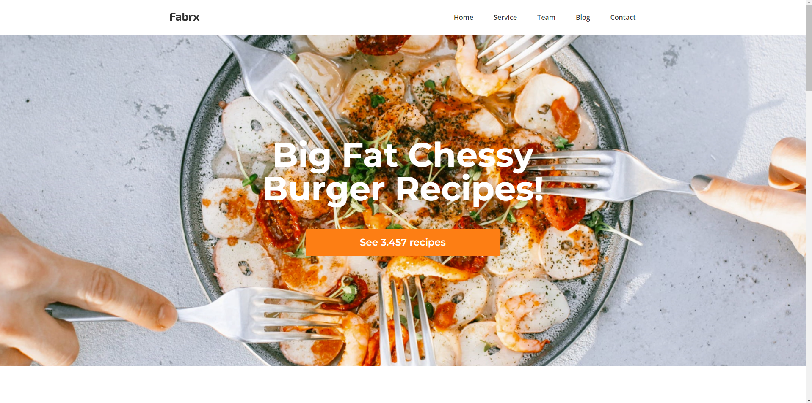
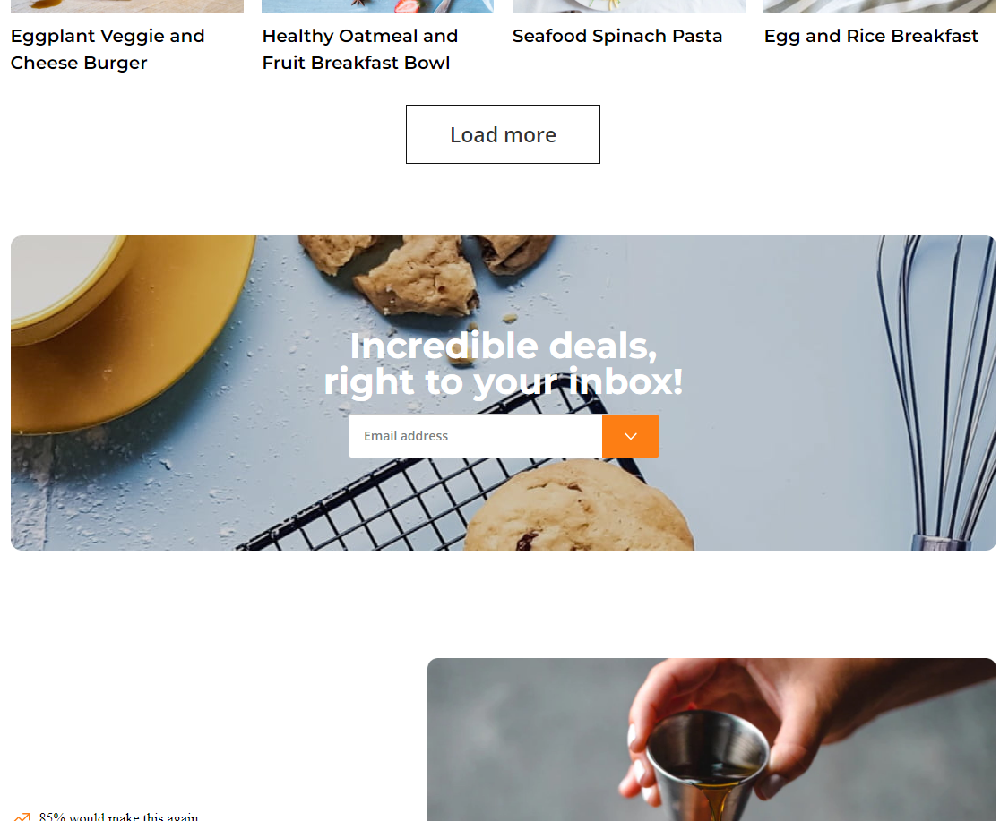

# Restoran Web Sitesi

Bu proje CSS öğrenirken yaptığım bir Restoran Web Sitesi projesidir 

# Öğrendiklerim 

Bu projeyi yaparken css flex kullanımını öğrendim

Divleri doğru kullanmayı düzgün isimlendirmeyi öğrendim

## Bilgisayarınızda Çalıştırın

Projeyi klonlayın

```bash
  git clone https://github.com/remolg/Firs-Project.git
```

Proje dizinine gidin

```bash
  cd Restaurant-Application
```


## Ekran Görüntüleri





  


